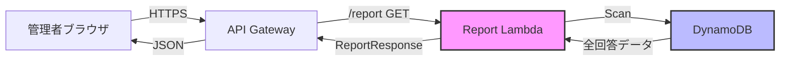

# 設計書: Daily Usage Report

## 概要

本設計書は、TeamViewerアンケートシステムの管理者ダッシュボードに日別利用者数レポート機能を追加するための技術設計を定義します。

### 目的

アンケート期間中（2026年3月2日～2026年6月27日）の各日付について、その日にTeamViewerを利用したユニークユーザー数を集計し、管理者が日ごとの利用傾向を把握できるようにします。

### スコープ

- 既存の `/report` エンドポイントを拡張し、日別利用者数データを追加
- バックエンド（Lambda関数）での集計ロジック実装
- フロントエンド（管理者ダッシュボード）でのテーブル表示追加
- 既存のレポート機能（時間帯別統計、利用パターン分布）との統合

### 制約事項

- アンケート期間: 2026年3月2日～2026年6月27日（118日間）
- 管理者権限を持つユーザーのみがアクセス可能
- レポート生成は10秒以内に完了すること
- 既存のレポート機能に影響を与えないこと

## アーキテクチャ

### システム構成



### データフロー

1. **認証フェーズ**
   - 管理者がダッシュボードにアクセス
   - JWTトークンによる認証・権限チェック

2. **データ取得フェーズ**
   - DynamoDBから全ユーザーの回答データをスキャン
   - 既存の `getAllResponses()` ユーティリティを使用

3. **集計フェーズ**
   - 日付ごとにユニークユーザーをカウント
   - アンケート期間内の全日付を網羅

4. **レスポンス生成フェーズ**
   - 既存のレポートデータに日別利用者数を追加
   - JSON形式でフロントエンドに返却

5. **表示フェーズ**
   - フロントエンドでテーブルをレンダリング
   - 日付昇順でソート表示

### 既存システムとの統合ポイント

- **Lambda関数**: `src/lambda/report.ts` を拡張
- **型定義**: `src/types/index.ts` の `ReportResponse` インターフェースを拡張
- **フロントエンド**: `frontend/src/admin.ts` と `frontend/admin.html` を拡張
- **認証**: 既存の `verifyAdminToken()` 関数を再利用
- **データアクセス**: 既存の `getAllResponses()` 関数を再利用

## コンポーネントとインターフェース

### バックエンドコンポーネント

#### 1. 日別利用者数集計関数

**関数名**: `calculateDailyUsage`

**シグネチャ**:
```typescript
const calculateDailyUsage = (
  responses: Array<{
    email: string;
    responses: Record<string, {
      morning: boolean;
      afternoon: boolean;
      evening: boolean;
    }>;
  }>,
  startDate: string,
  endDate: string
): Array<{ date: string; userCount: number }> => {
  // 実装
};
```

**責務**:
- アンケート期間内の全日付を生成
- 各日付について、その日に利用したユニークユーザー数をカウント
- 日付昇順でソートされた配列を返却

**アルゴリズム**:
1. 開始日から終了日までの日付配列を生成
2. 各日付について:
   - その日にいずれかの時間帯（morning/afternoon/evening）で利用したユーザーをSet型で収集
   - Setのサイズ（ユニークユーザー数）を記録
3. 日付と利用者数のペアの配列を返却

**エッジケース**:
- 回答データが存在しない日付: `userCount: 0` として記録
- ユーザーが複数時間帯で利用: 1人としてカウント（Set型で自動的に重複排除）

#### 2. Lambda関数の拡張

**ファイル**: `src/lambda/report.ts`

**変更点**:
- `calculateDailyUsage()` 関数を追加
- `handler()` 関数内で `calculateDailyUsage()` を呼び出し
- レスポンスに `dailyUsage` フィールドを追加

**既存機能への影響**:
- 既存の集計ロジック（`calculateTimeSlotStats`, `calculateUsagePatterns`）は変更なし
- エラーハンドリングは既存のパターンを踏襲
- パフォーマンス: 同一のデータセットを使用するため、追加のDynamoDBアクセスは不要

### フロントエンドコンポーネント

#### 1. 日別利用者数テーブル表示関数

**関数名**: `displayDailyUsageTable`

**シグネチャ**:
```typescript
const displayDailyUsageTable = (
  dailyUsage: Array<{ date: string; userCount: number }>
): void => {
  // 実装
};
```

**責務**:
- 日別利用者数データをHTMLテーブルとして描画
- 既存のレポート表示の下に配置

**実装詳細**:
- テーブル要素を動的に生成
- 日付列: YYYY-MM-DD形式で表示
- 利用者数列: 数値で表示
- スタイリング: 既存のテーブルスタイルと統一

#### 2. admin.ts の拡張

**変更点**:
- `ReportResponse` 型定義に `dailyUsage` フィールドを追加
- `displayReport()` 関数内で `displayDailyUsageTable()` を呼び出し

#### 3. admin.html の拡張

**変更点**:
- 日別利用者数テーブル用のコンテナ要素を追加
- セクション見出し「日別利用者数」を追加
- 既存のレポートセクションの下に配置

### インターフェース定義

#### ReportResponse 型の拡張

```typescript
export interface ReportResponse {
  success: boolean;
  data?: {
    totalResponses: number;
    targetCount: number;
    responseRate: number;
    timeSlotStats: {
      morning: { count: number; percentage: number };
      afternoon: { count: number; percentage: number };
      evening: { count: number; percentage: number };
    };
    usagePatterns: {
      allTimeSlots: number;
      twoTimeSlots: number;
      oneTimeSlot: number;
      noUsage: number;
    };
    dailyUsage: Array<{          // 新規追加
      date: string;              // YYYY-MM-DD形式
      userCount: number;         // その日の利用者数
    }>;
    generatedAt: string;
  };
  message?: string;
}
```

## データモデル

### 入力データ

**DynamoDB ResponseItem**:
```typescript
{
  email: string;                    // ユーザーメールアドレス
  responses: {
    [date: string]: {               // 日付キー（YYYY-MM-DD）
      morning: boolean;             // 午前中利用
      afternoon: boolean;           // 午後利用
      evening: boolean;             // 18時以降利用
    }
  };
  createdAt: string;
  updatedAt: string;
}
```

### 中間データ構造

**日付ごとのユーザーセット**:
```typescript
Map<string, Set<string>>
// キー: 日付（YYYY-MM-DD）
// 値: その日に利用したユーザーのメールアドレスのSet
```

### 出力データ

**日別利用者数配列**:
```typescript
Array<{
  date: string;        // YYYY-MM-DD形式
  userCount: number;   // 0以上の整数
}>
```

**特性**:
- 配列長: 118要素（2026年3月2日～2026年6月27日）
- ソート順: 日付昇順
- 欠損値なし: 回答がない日付も `userCount: 0` として含む

### データ変換フロー

```
DynamoDB ResponseItem[]
  ↓ getAllResponses()
Array<{ email, responses }>
  ↓ calculateDailyUsage()
Array<{ date, userCount }>
  ↓ ReportResponse
JSON
  ↓ displayDailyUsageTable()
HTML Table
```


## 正確性プロパティ

プロパティとは、システムのすべての有効な実行において真であるべき特性や動作のことです。つまり、システムが何をすべきかについての形式的な記述です。プロパティは、人間が読める仕様と機械で検証可能な正確性保証の橋渡しとなります。

### プロパティリフレクション

prework分析から以下のプロパティが特定されました:

- 1.2: 各日付で利用したユーザーのカウント
- 1.3: 複数時間帯利用時の重複排除
- 1.4: 全日付の網羅
- 1.5: 回答なし日付のゼロカウント
- 2.3: 日付フォーマット検証
- 2.4: 利用者数の数値型検証
- 2.5: 日付昇順ソート
- 5.1: ユーザー利用日付の識別
- 5.2: 利用者数の正確性

**重複の分析**:

- プロパティ1.2、1.3、5.1、5.2は、すべて「特定の日付における利用者の正確なカウント」という同じ概念を検証しています。これらは1つの包括的なプロパティに統合できます。
- プロパティ1.4と1.5は、「期間内の全日付が出力に含まれる」という概念で統合できます。
- プロパティ2.3、2.4、2.5は、出力データの形式とソート順を検証する独立したプロパティとして維持します。

### プロパティ1: 日別ユニークユーザー数の正確性

*任意の*回答データセットと任意の日付について、その日の利用者数は、その日にいずれかの時間帯（morning、afternoon、evening）で利用したユニークユーザーの数と正確に一致すること。同じユーザーが複数の時間帯で利用していても1人としてカウントされること。

**検証要件**: 要件 1.2, 1.3, 5.1, 5.2

### プロパティ2: アンケート期間の完全網羅

*任意の*回答データセットについて、出力配列は2026年3月2日から2026年6月27日までの全118日分のエントリを含むこと。回答データが存在しない日付についても、利用者数0として配列に含まれること。

**検証要件**: 要件 1.4, 1.5

### プロパティ3: 日付フォーマットの一貫性

*任意の*出力配列の各エントリについて、日付フィールドはYYYY-MM-DD形式（ISO 8601の日付部分）に準拠すること。

**検証要件**: 要件 2.3

### プロパティ4: 利用者数の非負整数性

*任意の*出力配列の各エントリについて、利用者数フィールドは0以上の整数であること。

**検証要件**: 要件 2.4

### プロパティ5: 日付の昇順ソート

*任意の*出力配列について、日付フィールドは時系列順（古い日付から新しい日付）にソートされていること。つまり、配列の任意の隣接する2つのエントリについて、前のエントリの日付は後のエントリの日付より前であること。

**検証要件**: 要件 2.5

## エラーハンドリング

### エラーの種類と対応

#### 1. データ取得エラー

**発生条件**:
- DynamoDBへの接続失敗
- `getAllResponses()` 関数の実行エラー

**対応**:
- 既存のエラーハンドリング機構を使用
- エラーコード: `ErrorCode.DB_003`
- エラーメッセージ: 「レポートの生成に失敗しました」
- CloudWatch Logsにエラー詳細を記録
- HTTP 500ステータスコードを返却

**既存機能への影響**:
- 既存のエラーハンドリングと同じフローのため、影響なし

#### 2. 集計処理エラー

**発生条件**:
- `calculateDailyUsage()` 関数内での予期しないエラー
- 不正なデータ形式

**対応**:
- try-catchブロックでエラーをキャッチ
- エラーコード: `ErrorCode.SYS_003`
- エラーメッセージ: 「集計処理中にエラーが発生しました」
- CloudWatch Logsにスタックトレースを記録
- HTTP 500ステータスコードを返却

**実装例**:
```typescript
try {
  const dailyUsage = calculateDailyUsage(
    allResponses,
    SURVEY_START_DATE,
    SURVEY_END_DATE
  );
  // レスポンスに追加
} catch (error) {
  logError('Daily usage calculation failed', error as Error, {
    errorCode: ErrorCode.SYS_003
  });
  // 既存のレポートは返却し、dailyUsageフィールドは省略
}
```

#### 3. 部分的な失敗の処理

**方針**:
- 日別利用者数の集計が失敗しても、既存のレポート（時間帯別統計、利用パターン分布）は正常に返却
- `dailyUsage` フィールドを省略することで、フロントエンドは既存のレポートのみを表示
- エラーメッセージをレスポンスに含めて、管理者に通知

**実装パターン**:
```typescript
const response: ReportResponse = {
  success: true,
  data: {
    totalResponses,
    targetCount,
    responseRate,
    timeSlotStats,
    usagePatterns,
    // dailyUsageは集計成功時のみ追加
    generatedAt
  },
  message: dailyUsageError 
    ? 'レポートを生成しましたが、日別利用者数の集計に失敗しました' 
    : 'レポートが正常に生成されました'
};
```

### エラーログの形式

```typescript
logError('Daily usage calculation failed', error as Error, {
  errorCode: ErrorCode.SYS_003,
  context: {
    responseCount: allResponses.length,
    startDate: SURVEY_START_DATE,
    endDate: SURVEY_END_DATE
  }
});
```

### フロントエンドのエラー表示

**条件分岐**:
```typescript
if (reportData.data?.dailyUsage) {
  displayDailyUsageTable(reportData.data.dailyUsage);
} else {
  // 日別利用者数セクションを非表示または「データなし」を表示
  const dailyUsageSection = document.getElementById('daily-usage-section');
  if (dailyUsageSection) {
    dailyUsageSection.style.display = 'none';
  }
}
```

## テスト戦略

### デュアルテストアプローチ

本機能のテストは、ユニットテストとプロパティベーステストの両方を使用します。

- **ユニットテスト**: 特定の例、エッジケース、エラー条件を検証
- **プロパティベーステスト**: すべての入力に対して成立する普遍的なプロパティを検証

両者は補完的であり、包括的なカバレッジに必要です。ユニットテストは具体的なバグを捕捉し、プロパティベーステストは一般的な正確性を検証します。

### プロパティベーステスト

**テストライブラリ**: fast-check（既存プロジェクトで使用中）

**設定**:
- 各プロパティテストは最低100回の反復を実行
- 各テストは設計書のプロパティを参照するタグを含む
- タグ形式: `Feature: daily-usage-report, Property {番号}: {プロパティテキスト}`

**テストファイル**: `src/__tests__/dailyUsage.property.test.ts`

**プロパティテスト1: 日別ユニークユーザー数の正確性**
```typescript
// Feature: daily-usage-report, Property 1: 日別ユニークユーザー数の正確性
test('任意の回答データについて、各日付の利用者数はユニークユーザー数と一致する', () => {
  fc.assert(
    fc.property(
      fc.array(arbResponseItem()),  // ランダムな回答データ生成
      fc.date({ min: new Date('2026-03-02'), max: new Date('2026-06-27') }),
      (responses, testDate) => {
        const result = calculateDailyUsage(responses, '2026-03-02', '2026-06-27');
        const dateStr = testDate.toISOString().split('T')[0];
        const entry = result.find(e => e.date === dateStr);
        
        // 手動でユニークユーザーをカウント
        const uniqueUsers = new Set<string>();
        responses.forEach(r => {
          const dayResponse = r.responses[dateStr];
          if (dayResponse && (dayResponse.morning || dayResponse.afternoon || dayResponse.evening)) {
            uniqueUsers.add(r.email);
          }
        });
        
        expect(entry?.userCount).toBe(uniqueUsers.size);
      }
    ),
    { numRuns: 100 }
  );
});
```

**プロパティテスト2: アンケート期間の完全網羅**
```typescript
// Feature: daily-usage-report, Property 2: アンケート期間の完全網羅
test('任意の回答データについて、出力は全118日分を含む', () => {
  fc.assert(
    fc.property(
      fc.array(arbResponseItem()),
      (responses) => {
        const result = calculateDailyUsage(responses, '2026-03-02', '2026-06-27');
        
        // 配列長の検証
        expect(result).toHaveLength(118);
        
        // 開始日と終了日の検証
        expect(result[0].date).toBe('2026-03-02');
        expect(result[117].date).toBe('2026-06-27');
        
        // 連続性の検証
        for (let i = 1; i < result.length; i++) {
          const prevDate = new Date(result[i - 1].date);
          const currDate = new Date(result[i].date);
          const diffDays = (currDate.getTime() - prevDate.getTime()) / (1000 * 60 * 60 * 24);
          expect(diffDays).toBe(1);
        }
      }
    ),
    { numRuns: 100 }
  );
});
```

**プロパティテスト3: 日付フォーマットの一貫性**
```typescript
// Feature: daily-usage-report, Property 3: 日付フォーマットの一貫性
test('任意の回答データについて、全ての日付はYYYY-MM-DD形式である', () => {
  fc.assert(
    fc.property(
      fc.array(arbResponseItem()),
      (responses) => {
        const result = calculateDailyUsage(responses, '2026-03-02', '2026-06-27');
        const dateRegex = /^\d{4}-\d{2}-\d{2}$/;
        
        result.forEach(entry => {
          expect(entry.date).toMatch(dateRegex);
          // 有効な日付であることも確認
          expect(new Date(entry.date).toString()).not.toBe('Invalid Date');
        });
      }
    ),
    { numRuns: 100 }
  );
});
```

**プロパティテスト4: 利用者数の非負整数性**
```typescript
// Feature: daily-usage-report, Property 4: 利用者数の非負整数性
test('任意の回答データについて、全ての利用者数は非負整数である', () => {
  fc.assert(
    fc.property(
      fc.array(arbResponseItem()),
      (responses) => {
        const result = calculateDailyUsage(responses, '2026-03-02', '2026-06-27');
        
        result.forEach(entry => {
          expect(Number.isInteger(entry.userCount)).toBe(true);
          expect(entry.userCount).toBeGreaterThanOrEqual(0);
        });
      }
    ),
    { numRuns: 100 }
  );
});
```

**プロパティテスト5: 日付の昇順ソート**
```typescript
// Feature: daily-usage-report, Property 5: 日付の昇順ソート
test('任意の回答データについて、日付は昇順にソートされている', () => {
  fc.assert(
    fc.property(
      fc.array(arbResponseItem()),
      (responses) => {
        const result = calculateDailyUsage(responses, '2026-03-02', '2026-06-27');
        
        for (let i = 1; i < result.length; i++) {
          const prevDate = new Date(result[i - 1].date);
          const currDate = new Date(result[i].date);
          expect(currDate.getTime()).toBeGreaterThan(prevDate.getTime());
        }
      }
    ),
    { numRuns: 100 }
  );
});
```

### ユニットテスト

**テストファイル**: `src/__tests__/dailyUsage.test.ts`

**ユニットテストのスコープ**:
- 具体的な例による動作確認
- エッジケースの検証
- エラー条件の検証

**テストケース例**:

1. **空の回答データ**: 全日付で利用者数0
2. **単一ユーザー、単一日付**: 正確にカウント
3. **複数時間帯利用**: 重複排除の確認
4. **期間境界**: 開始日と終了日の正確な処理
5. **不正なデータ形式**: エラーハンドリングの確認

```typescript
describe('calculateDailyUsage', () => {
  test('空の回答データの場合、全日付で利用者数0を返す', () => {
    const result = calculateDailyUsage([], '2026-03-02', '2026-06-27');
    expect(result).toHaveLength(118);
    result.forEach(entry => {
      expect(entry.userCount).toBe(0);
    });
  });

  test('単一ユーザーが単一日付で利用した場合、正確にカウントする', () => {
    const responses = [{
      email: 'user@okijoh.co.jp',
      responses: {
        '2026-03-02': { morning: true, afternoon: false, evening: false }
      }
    }];
    const result = calculateDailyUsage(responses, '2026-03-02', '2026-06-27');
    expect(result[0].userCount).toBe(1);
    expect(result[1].userCount).toBe(0);
  });

  test('同じユーザーが複数時間帯で利用した場合、1人としてカウントする', () => {
    const responses = [{
      email: 'user@okijoh.co.jp',
      responses: {
        '2026-03-02': { morning: true, afternoon: true, evening: true }
      }
    }];
    const result = calculateDailyUsage(responses, '2026-03-02', '2026-06-27');
    expect(result[0].userCount).toBe(1);
  });
});
```

### 統合テスト

**スコープ**:
- Lambda関数全体の動作確認
- 既存機能との統合確認
- 認証フローの確認

**テストケース**:
1. 管理者トークンでのレポート生成成功
2. 非管理者トークンでのアクセス拒否
3. 日別利用者数が既存レポートと共に返却されること
4. 日別利用者数の集計失敗時、既存レポートは正常に返却されること

### フロントエンドテスト

**スコープ**:
- テーブル表示の確認
- エラー時の表示確認

**テストケース**:
1. 日別利用者数テーブルが正しくレンダリングされること
2. テーブルが既存レポートの下に配置されること
3. dailyUsageフィールドがない場合、セクションが非表示になること

### テスト実行コマンド

```bash
# 全テスト実行
npm test

# プロパティベーステストのみ
npm test -- dailyUsage.property.test.ts

# ユニットテストのみ
npm test -- dailyUsage.test.ts

# カバレッジ付き
npm test -- --coverage
```

### テストカバレッジ目標

- ステートメントカバレッジ: 90%以上
- ブランチカバレッジ: 85%以上
- 関数カバレッジ: 100%（新規追加関数）
- ラインカバレッジ: 90%以上
