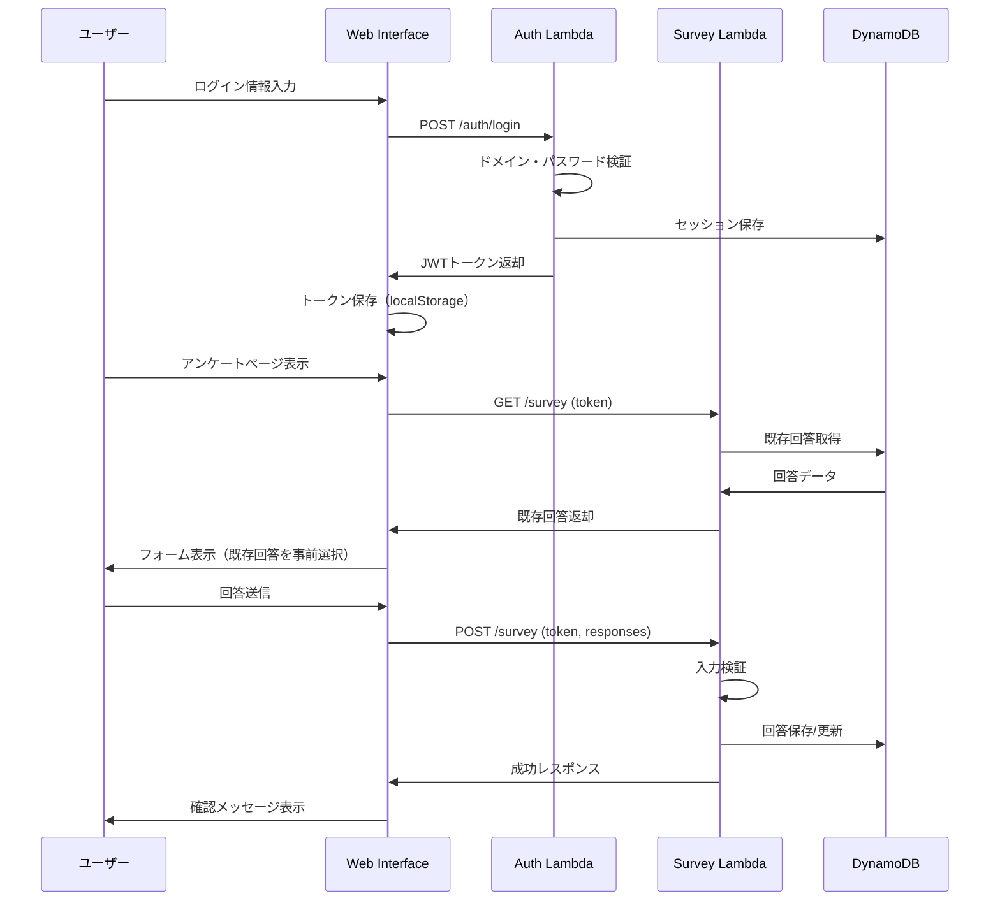

# 技術設計書: TeamViewerアンケートアプリケーション

## 概要

本システムは、社内でのTeamViewer利用状況を収集・集計するためのサーバーレスWebアプリケーションです。AWS Lambdaの無料枠内で動作し、20〜25名の社員が3つの時間帯（午前中、午後、18時以降）におけるTeamViewerの利用状況をTrue/Falseで回答できます。

アンケート期間: 2026年3月2日～2026年6月27日

### 主要な機能

- ドメイン制限付きユーザー認証（@okijoh.co.jp）
- 1週間単位の表形式でのアンケート回答入力
- 各日付×時間帯のセルをクリックで使用/未使用を切り替え
- 週単位のナビゲーション（前の週/次の週）
- ログイン時にシステム日付の週を自動表示
- 回答の表示・編集機能（メールアドレスをキーとした更新可能な保存）
- 管理者専用の集計レポート生成
- レスポンシブWebインターフェース

### 技術スタック

- **フロントエンド**: HTML5, CSS3, JavaScript（バニラJS）
- **バックエンド**: AWS Lambda（Node.js 18.x）
- **データストア**: Amazon DynamoDB
- **認証**: セッションベース認証（JWT）
- **ホスティング**: AWS Lambda + API Gateway
- **ロギング**: Amazon CloudWatch Logs

### フロントエンドスタイル仕様

- **ベースフォントサイズ**: 16px（body要素）
- **グリッドセル高さ**: 38px（従来の50pxから約75%に縮小）
- **グリッドセル幅**: 80px
- **ヘッダーフォントサイズ**: 15px
- **週表示フォントサイズ**: 17px
- **ユーザーメールフォントサイズ**: 15px
- **凡例フォントサイズ**: 15px
- **テーブルパディング**: ヘッダー 12px、セル 9px
- **タイムゾーン**: 日本時間（JST, UTC+9）を基準として日付を処理

## アーキテクチャ

### システムアーキテクチャ図

```mermaid
graph TB
    User[ユーザー<br/>@okijoh.co.jp] -->|HTTPS| APIGW[API Gateway]
    Admin[管理者<br/>karimata@okijoh.co.jp] -->|HTTPS| APIGW
    
    APIGW --> AuthLambda[認証Lambda]
    APIGW --> SurveyLambda[アンケートLambda]
    APIGW --> ReportLambda[レポートLambda]
    
    AuthLambda -->|検証| DDB[(DynamoDB<br/>Sessions)]
    SurveyLambda -->|読み書き| DDB2[(DynamoDB<br/>Responses)]
    ReportLambda -->|読み取り| DDB2
    
    AuthLambda -.->|ログ| CW[CloudWatch Logs]
    SurveyLambda -.->|ログ| CW
    ReportLambda -.->|ログ| CW
    
    ENV[環境変数<br/>パスワード/期間設定] -.-> AuthLambda
    ENV -.-> SurveyLambda
```

### アーキテクチャの原則

1. **サーバーレス優先**: AWS Lambdaを使用してインフラ管理を最小化
2. **ステートレス設計**: Lambda関数は状態を保持せず、DynamoDBに永続化
3. **セキュリティファースト**: HTTPS通信、データ暗号化、入力検証を徹底
4. **コスト最適化**: 無料枠内での運用を前提とした設計
5. **シンプルさ**: 小規模チーム向けに複雑さを排除

## コンポーネントとインターフェース

### 1. 認証Lambda（AuthLambda）

**責務**: ユーザー認証とセッション管理

**入力**:
```typescript
interface LoginRequest {
  email: string;        // @okijoh.co.jpドメイン
  password: string;     // 共通パスワードまたは管理者パスワード
}
```

**出力**:
```typescript
interface LoginResponse {
  success: boolean;
  token?: string;       // JWTトークン
  role: 'user' | 'admin';
  message?: string;     // エラーメッセージ
}
```

**処理フロー**:
1. メールアドレスのドメイン検証（@okijoh.co.jp）
2. パスワード検証（環境変数と照合）
3. 管理者判定（karimata@okijoh.co.jp）
4. JWTトークン生成（有効期限: 24時間）
5. セッション情報をDynamoDBに保存

### 2. アンケートLambda（SurveyLambda）

**責務**: アンケート回答の保存・取得・更新

**入力（回答送信）**:
```typescript
interface SubmitSurveyRequest {
  token: string;                    // 認証トークン
  responses: {
    [date: string]: {               // 日付をキー（YYYY-MM-DD形式）
      morning: boolean;             // 午前中（9:00-12:00）
      afternoon: boolean;           // 午後（13:00-18:00）
      evening: boolean;             // 18時以降（18:00-）
    }
  };
}
```

**入力（回答取得）**:
```typescript
interface GetSurveyRequest {
  token: string;                    // 認証トークン
  startDate?: string;               // 取得開始日（オプション）
  endDate?: string;                 // 取得終了日（オプション）
}
```

**出力**:
```typescript
interface SurveyResponse {
  success: boolean;
  data?: {
    email: string;
    responses: {
      [date: string]: {
        morning: boolean;
        afternoon: boolean;
        evening: boolean;
      }
    };
    createdAt: string;              // ISO 8601形式
    updatedAt: string;              // ISO 8601形式
  };
  currentWeekStart?: string;        // システム日付の週の開始日
  message?: string;
}
    evening: boolean;               // 18時以降（18:00-）
  };
}
```

**入力（回答取得）**:
```typescript
interface GetSurveyRequest {
  token: string;                    // 認証トークン
}
```

**出力**:
```typescript
interface SurveyResponse {
  success: boolean;
  data?: {
    email: string;
    responses: {
      morning: boolean;
      afternoon: boolean;
      evening: boolean;
    };
    createdAt: string;              // ISO 8601形式
    updatedAt: string;              // ISO 8601形式
  };
  message?: string;
}
```

**処理フロー（送信）**:
1. JWTトークン検証
2. アンケート期間の確認（2026年3月2日～6月27日）
3. 入力データの検証（日付形式、時間帯の値）
4. メールアドレスをキーとしてDynamoDBに保存/更新（日付ごとのデータ構造）
5. タイムスタンプの記録

**処理フロー（取得）**:
1. JWTトークン検証
2. メールアドレスをキーとしてDynamoDBから取得
3. システム日付を計算し、その週の開始日を返却
4. システム日付がアンケート期間外の場合、期間の開始週または終了週の開始日を返却
5. 既存回答を返却（存在しない場合は空）

### 3. レポートLambda（ReportLambda）

**責務**: 集計レポートの生成（管理者専用）

**入力**:
```typescript
interface GenerateReportRequest {
  token: string;                    // 管理者トークン
}
```

**出力**:
```typescript
interface ReportResponse {
  success: boolean;
  data?: {
    totalResponses: number;         // 回答総数
    targetCount: number;            // 対象人数（20-25名）
    responseRate: number;           // 回答率（%）
    timeSlotStats: {
      morning: {
        count: number;              // 利用者数
        percentage: number;         // 利用率（%）
      };
      afternoon: {
        count: number;
        percentage: number;
      };
      evening: {
        count: number;
        percentage: number;
      };
    };
    usagePatterns: {
      allTimeSlots: number;         // 全時間帯利用
      twoTimeSlots: number;         // 2時間帯利用
      oneTimeSlot: number;          // 1時間帯利用
      noUsage: number;              // 未利用
    };
    generatedAt: string;            // レポート生成日時
  };
  message?: string;
}
```

**処理フロー**:
1. JWTトークン検証（管理者権限チェック）
2. DynamoDBから全回答をスキャン
3. 時間帯別の集計計算
4. 利用パターンの分類
5. レポートデータの生成

### 4. フロントエンド（Web Interface）

**責務**: ユーザーインターフェースの提供

**ページ構成**:

1. **ログインページ（/login）**
   - メールアドレス入力フィールド
   - パスワード入力フィールド
   - ログインボタン
   - エラーメッセージ表示エリア

2. **アンケートページ（/survey）**
   - ヘッダー部：ログインユーザーのメールアドレス表示、ログアウトボタン
   - 週選択部：「前の週」「次の週」ボタン、現在表示中の週の日付範囲
   - アンケート表：1週間分の日付×3つの時間帯のグリッド
     - グリッドのセル幅はヘッダーラベル幅と同じ
     - グリッドに縦罫線と横罫線を表示
     - ヘッダーラベル（時間帯）は均等配置
     - 日付はyyyy/mm/dd形式で曜日も表示（例: 2026/03/15 (月)）
   - 各セルをクリックで使用/未使用を切り替え（緑色✓/グレー-）
   - 凡例：使用/未使用の色の説明
   - クリアボタン：現在の週のデータをリセット
   - 保存ボタン：データを送信

3. **管理者ダッシュボード（/admin）**
   - 回答総数表示
   - 時間帯別利用統計（表形式）
   - 利用パターン分布（グラフ）
   - レポート生成ボタン

**API通信**:
- Fetch APIを使用したRESTful通信
- JWTトークンをAuthorizationヘッダーに含める
- エラーハンドリングとユーザーフィードバック

## データモデル

### DynamoDBテーブル設計

#### 1. Sessionsテーブル

**目的**: セッション管理

| 属性名 | 型 | 説明 |
|--------|-----|------|
| sessionId (PK) | String | セッションID（UUID） |
| email | String | ユーザーメールアドレス |
| role | String | ユーザーロール（user/admin） |
| createdAt | Number | 作成タイムスタンプ（Unix時間） |
| expiresAt | Number | 有効期限（Unix時間） |

**TTL設定**: expiresAt属性を使用して自動削除

#### 2. Responsesテーブル

**目的**: アンケート回答の保存

| 属性名 | 型 | 説明 |
|--------|-----|------|
| email (PK) | String | ユーザーメールアドレス（キー） |
| responses | Map | 日付をキーとした回答データ |
| responses[date].morning | Boolean | 午前中の利用状況 |
| responses[date].afternoon | Boolean | 午後の利用状況 |
| responses[date].evening | Boolean | 18時以降の利用状況 |
| createdAt | String | 初回回答日時（ISO 8601） |
| updatedAt | String | 最終更新日時（ISO 8601） |

**データ構造例**:
```json
{
  "email": "yamada@okijoh.co.jp",
  "responses": {
    "2026-03-15": {
      "morning": true,
      "afternoon": false,
      "evening": true
    },
    "2026-03-16": {
      "morning": true,
      "afternoon": true,
      "evening": false
    }
  },
  "createdAt": "2026-03-15T09:00:00Z",
  "updatedAt": "2026-03-16T10:30:00Z"
}
```

**インデックス**: なし（小規模データのためスキャンで十分）

### データフロー図




## 正確性プロパティ

プロパティとは、システムのすべての有効な実行において真であるべき特性や動作のことです。本質的には、システムが何をすべきかについての形式的な記述です。プロパティは、人間が読める仕様と機械で検証可能な正確性保証との橋渡しとなります。

### Property 1: ドメイン検証とエラーメッセージ

*任意の*メールアドレスに対して、@okijoh.co.jpドメインのものは認証処理に進み、それ以外のドメインは「このアンケートは社内メンバー専用です」というエラーメッセージを返すこと

**検証対象: 要件 1.2, 1.8**

### Property 2: パスワード検証

*任意の*パスワード入力に対して、事前設定された共通パスワードまたは管理者パスワードと一致する場合のみ認証が成功すること

**検証対象: 要件 1.3**

### Property 3: 認証成功時のセッション作成

*任意の*有効な認証情報（正しいドメインと正しいパスワード）に対して、認証が成功した場合、JWTトークンを含むセッションが作成されること

**検証対象: 要件 1.5**

### Property 4: 認証失敗時のエラーメッセージ

*任意の*無効な認証情報（間違ったパスワードまたは無効なドメイン）に対して、認証が失敗した場合、適切なエラーメッセージが返されること

**検証対象: 要件 1.7**

### Property 5: 認証済みユーザーのアクセス制御

*任意の*リクエストに対して、有効なJWTトークンを持つ場合のみアンケートフォームにアクセスでき、トークンがない場合はアクセスが拒否されること

**検証対象: 要件 2.1**

### Property 6: 既存回答の表示

*任意の*ユーザーに対して、過去に回答が存在する場合、ログイン時にその回答がフォームに事前選択された状態で表示されること

**検証対象: 要件 2.2, 4.2**

### Property 7: 入力検証（全時間帯の回答必須）

*任意の*アンケート送信に対して、3つの時間帯（午前中、午後、18時以降）すべてについて回答が選択されている場合のみ検証が成功し、1つでも欠けている場合は検証が失敗すること

**検証対象: 要件 2.4**

### Property 8: 回答の保存

*任意の*有効な回答データ（3つの時間帯すべてに回答あり）に対して、ユーザーのメールアドレスをキーとしてDynamoDBに正常に保存されること

**検証対象: 要件 2.5, 3.1**

### Property 9: 既存回答の更新

*任意の*ユーザーに対して、既に回答が存在する状態で新しい回答を送信した場合、既存の回答が新しい回答で上書き更新されること

**検証対象: 要件 2.6, 3.4**

### Property 10: 検証失敗時のエラーメッセージ

*任意の*不完全な回答データ（1つ以上の時間帯が未選択）に対して、検証が失敗した場合、未回答の時間帯を示す具体的なエラーメッセージが返されること

**検証対象: 要件 2.7**

### Property 11: 保存成功時の確認メッセージ

*任意の*有効な回答データに対して、保存が成功した場合、ユーザーに確認メッセージが表示されること

**検証対象: 要件 2.8**

### Property 12: タイムスタンプの記録

*任意の*回答保存時に、createdAt（初回作成日時）とupdatedAt（最終更新日時）のタイムスタンプが正しく記録されること

**検証対象: 要件 3.2**

### Property 13: リトライロジック

*任意の*保存失敗に対して、システムは最大3回まで保存操作を再試行すること

**検証対象: 要件 3.5**

### Property 14: リトライ失敗時のエラーハンドリング

*任意の*保存操作に対して、3回のリトライすべてが失敗した場合、エラーがログに記録され、ユーザーにエラーレスポンスが返されること

**検証対象: 要件 3.6**

### Property 15: 既存回答の取得

*任意の*ユーザーに対して、ログイン時にそのユーザーのメールアドレスをキーとして既存回答が正しく取得されること（存在しない場合は空）

**検証対象: 要件 4.1**

### Property 16: 最終更新日時の表示

*任意の*既存回答に対して、最終更新日時（updatedAt）がWeb_Interfaceに表示されること

**検証対象: 要件 4.4**

### Property 17: 回答の編集と再送信

*任意の*既存回答に対して、ユーザーが回答を変更して再送信した場合、変更内容が正しく保存されること

**検証対象: 要件 4.5**

### Property 18: 管理者アクセス制御

*任意の*レポート生成リクエストに対して、管理者権限を持つユーザー（karimata@okijoh.co.jp）のみがアクセスでき、それ以外のユーザーはアクセスが拒否されること

**検証対象: 要件 6.1, 7.6**

### Property 19: 回答総数の計算

*任意の*回答データセットに対して、Report_Generatorは正しく回答総数を計算すること

**検証対象: 要件 6.2**

### Property 20: 時間帯別統計の集計

*任意の*回答データセットに対して、Report_Generatorは各時間帯（午前中、午後、18時以降）ごとの利用者数と利用率を正しく集計すること

**検証対象: 要件 6.3**

### Property 21: 利用パターンの分類

*任意の*回答データセットに対して、Report_Generatorは利用パターン（全時間帯利用、2時間帯利用、1時間帯利用、未利用）を正しく分類すること

**検証対象: 要件 6.4**

### Property 22: レポートデータの表示

*任意の*集計データに対して、時間帯別の利用傾向が表形式またはグラフ形式で表示されること

**検証対象: 要件 6.5**

### Property 23: 環境変数からのパスワード読み込み

*任意の*起動時に、Authentication_Handlerは共通パスワードと管理者パスワードを環境変数から正しく読み込むこと

**検証対象: 要件 7.3**

### Property 24: パスワードの非露出

*任意の*ログ出力またはAPIレスポンスに対して、パスワード情報が含まれていないこと

**検証対象: 要件 7.4**

### Property 25: 入力データのサニタイズ

*任意の*入力データ（メールアドレス、回答データ等）に対して、インジェクション攻撃を防ぐために適切にサニタイズされること

**検証対象: 要件 7.5**

### Property 26: アンケート期間の設定

*任意の*開始日と終了日に対して、システムはアンケート期間（2026年3月2日～6月27日）を正しく設定できること

**検証対象: 要件 8.1**

### Property 27: 開始前のアクセス制御

*任意の*日付設定に対して、現在日時が2026年3月2日より前の場合、「アンケートはまだ開始されていません」というメッセージが表示され、回答送信が拒否されること

**検証対象: 要件 8.2**

### Property 28: 終了後のアクセス制御

*任意の*日付設定に対して、現在日時が2026年6月27日より後の場合、「アンケートは終了しました」というメッセージが表示され、回答送信が拒否されること

**検証対象: 要件 8.3**

### Property 29: アクティブ期間中の回答受付

*任意の*日付設定に対して、現在日時が2026年3月2日～6月27日の間にある場合、回答送信が正常に受け付けられること

**検証対象: 要件 8.4**

### Property 30: 終了後のレポート生成許可

*任意の*日付設定に対して、アンケート期間が終了した後でも、管理者はレポート生成にアクセスできること

**検証対象: 要件 8.5**

### Property 31: タッチターゲットサイズ

*任意の*インタラクティブUI要素（ボタン、チェックボックス等）に対して、最小44pxのタッチターゲットサイズが確保されていること

**検証対象: 要件 9.4**

### Property 32: エラーログの記録

*任意の*エラー発生時に、タイムスタンプ、エラータイプ、コンテキスト情報を含むログが正しく記録されること

**検証対象: 要件 10.1**

### Property 33: 成功ログの記録

*任意の*成功した回答送信に対して、監査目的のログが正しく記録されること

**検証対象: 要件 10.2**

### Property 34: タイムアウトログの記録

*任意の*Lambda関数のタイムアウト発生時に、リクエストの詳細を含むタイムアウトイベントがログに記録されること

**検証対象: 要件 10.3**

### Property 35: ログクエリ機能

*任意の*日付範囲とエラータイプに対して、管理者がログを検索・フィルタリングできること

**検証対象: 要件 10.5**

## エラーハンドリング

### エラー分類

システムは以下のエラーカテゴリを定義し、それぞれに適切な処理を実装します：

#### 1. 認証エラー

**エラーコード**: AUTH_001 - AUTH_005

| コード | 説明 | HTTPステータス | ユーザーメッセージ |
|--------|------|----------------|-------------------|
| AUTH_001 | 無効なドメイン | 403 | このアンケートは社内メンバー専用です |
| AUTH_002 | パスワード不一致 | 401 | メールアドレスまたはパスワードが正しくありません |
| AUTH_003 | トークン期限切れ | 401 | セッションが期限切れです。再度ログインしてください |
| AUTH_004 | トークン不正 | 401 | 無効な認証情報です |
| AUTH_005 | 権限不足 | 403 | この機能にアクセスする権限がありません |

**処理方針**:
- ログイン画面にリダイレクト
- エラーメッセージを表示
- セキュリティログに記録（ブルートフォース攻撃の検出）

#### 2. 入力検証エラー

**エラーコード**: VAL_001 - VAL_003

| コード | 説明 | HTTPステータス | ユーザーメッセージ |
|--------|------|----------------|-------------------|
| VAL_001 | 必須フィールド未入力 | 400 | すべての時間帯について回答を選択してください |
| VAL_002 | 不正な形式 | 400 | 入力形式が正しくありません |
| VAL_003 | 危険な文字列検出 | 400 | 入力内容に使用できない文字が含まれています |

**処理方針**:
- フォームにエラーメッセージを表示
- 入力フィールドをハイライト
- 送信をブロック

#### 3. データストアエラー

**エラーコード**: DB_001 - DB_004

| コード | 説明 | HTTPステータス | ユーザーメッセージ |
|--------|------|----------------|-------------------|
| DB_001 | 接続エラー | 500 | 一時的なエラーが発生しました。しばらくしてから再度お試しください |
| DB_002 | 保存失敗 | 500 | 回答の保存に失敗しました。再度お試しください |
| DB_003 | 取得失敗 | 500 | データの取得に失敗しました |
| DB_004 | タイムアウト | 504 | 処理がタイムアウトしました。再度お試しください |

**処理方針**:
- 最大3回のリトライ
- エラーログに詳細を記録
- ユーザーに再試行を促す

#### 4. 期間制約エラー

**エラーコード**: PERIOD_001 - PERIOD_002

| コード | 説明 | HTTPステータス | ユーザーメッセージ |
|--------|------|----------------|-------------------|
| PERIOD_001 | 開始前アクセス | 403 | アンケートはまだ開始されていません（開始日: 2026年3月2日） |
| PERIOD_002 | 終了後アクセス | 403 | アンケートは終了しました（終了日: 2026年6月27日） |

**処理方針**:
- メッセージページを表示
- 回答送信をブロック
- レポート生成は許可（終了後のみ）

#### 5. システムエラー

**エラーコード**: SYS_001 - SYS_003

| コード | 説明 | HTTPステータス | ユーザーメッセージ |
|--------|------|----------------|-------------------|
| SYS_001 | Lambda関数エラー | 500 | システムエラーが発生しました |
| SYS_002 | メモリ不足 | 500 | システムエラーが発生しました |
| SYS_003 | 予期しないエラー | 500 | 予期しないエラーが発生しました |

**処理方針**:
- 詳細なエラーログを記録
- 管理者に通知（CloudWatch Alarm）
- ユーザーには一般的なエラーメッセージを表示

### エラーログフォーマット

すべてのエラーは以下の形式でCloudWatch Logsに記録されます：

```json
{
  "timestamp": "2024-01-15T10:30:45.123Z",
  "level": "ERROR",
  "errorCode": "DB_002",
  "errorType": "DataStoreError",
  "message": "Failed to save survey response",
  "context": {
    "userId": "user@okijoh.co.jp",
    "requestId": "abc123-def456",
    "functionName": "SurveyLambda",
    "retryCount": 3
  },
  "stackTrace": "..."
}
```

### グローバルエラーハンドラ

各Lambda関数は以下のグローバルエラーハンドラを実装します：

```javascript
async function globalErrorHandler(error, context) {
  // エラー分類
  const errorInfo = classifyError(error);
  
  // ログ記録
  await logError({
    timestamp: new Date().toISOString(),
    level: 'ERROR',
    errorCode: errorInfo.code,
    errorType: errorInfo.type,
    message: error.message,
    context: {
      requestId: context.requestId,
      functionName: context.functionName,
      ...errorInfo.context
    },
    stackTrace: error.stack
  });
  
  // ユーザーレスポンス生成
  return {
    statusCode: errorInfo.httpStatus,
    body: JSON.stringify({
      success: false,
      errorCode: errorInfo.code,
      message: errorInfo.userMessage
    })
  };
}
```

## テスト戦略

### デュアルテストアプローチ

本システムでは、ユニットテストとプロパティベーステストの両方を実施し、包括的なテストカバレッジを実現します。

#### ユニットテスト

**目的**: 具体的な例、エッジケース、エラー条件の検証

**対象**:
- 特定のメールアドレスでの認証（例: karimata@okijoh.co.jp）
- 空の回答データの拒否
- 特定のエラーコードの返却
- UI要素の存在確認

**ツール**: Jest

**カバレッジ目標**: 80%以上

#### プロパティベーステスト

**目的**: 普遍的なプロパティの検証（すべての入力に対して）

**対象**:
- ドメイン検証ロジック（任意のメールアドレス）
- 回答の保存・更新ロジック（任意の回答データ）
- 集計ロジック（任意の回答データセット）
- 期間チェックロジック（任意の日付設定）

**ツール**: fast-check（JavaScript用プロパティベーステストライブラリ）

**設定**: 各テストで最低100回の反復実行

**タグ形式**: 
```javascript
// Feature: teamviewer-survey-app, Property 1: ドメイン検証とエラーメッセージ
test('Property 1: Domain validation and error messages', () => {
  fc.assert(
    fc.property(fc.emailAddress(), (email) => {
      // テストロジック
    }),
    { numRuns: 100 }
  );
});
```

### テストカテゴリ

#### 1. 認証テスト

**ユニットテスト**:
- 管理者アカウントでのログイン成功
- 無効なパスワードでのログイン失敗
- トークン期限切れの処理

**プロパティテスト**:
- Property 1: ドメイン検証とエラーメッセージ
- Property 2: パスワード検証
- Property 3: 認証成功時のセッション作成
- Property 4: 認証失敗時のエラーメッセージ

#### 2. アンケート回答テスト

**ユニットテスト**:
- 3つの時間帯すべてがTrueの回答送信
- 1つの時間帯のみTrueの回答送信
- 空のフォーム表示

**プロパティテスト**:
- Property 7: 入力検証（全時間帯の回答必須）
- Property 8: 回答の保存
- Property 9: 既存回答の更新
- Property 10: 検証失敗時のエラーメッセージ

#### 3. データ永続化テスト

**ユニットテスト**:
- 特定のメールアドレスでの保存
- 保存失敗時のリトライ（モック使用）

**プロパティテスト**:
- Property 12: タイムスタンプの記録
- Property 13: リトライロジック
- Property 14: リトライ失敗時のエラーハンドリング

#### 4. レポート生成テスト

**ユニットテスト**:
- 5件の回答データでの集計
- 空のデータセットでの集計

**プロパティテスト**:
- Property 19: 回答総数の計算
- Property 20: 時間帯別統計の集計
- Property 21: 利用パターンの分類

#### 5. セキュリティテスト

**ユニットテスト**:
- SQLインジェクション試行の拒否
- XSS攻撃試行の拒否

**プロパティテスト**:
- Property 24: パスワードの非露出
- Property 25: 入力データのサニタイズ

#### 6. 期間管理テスト

**ユニットテスト**:
- 特定の日付での開始前アクセス
- 特定の日付での終了後アクセス

**プロパティテスト**:
- Property 27: 開始前のアクセス制御
- Property 28: 終了後のアクセス制御
- Property 29: アクティブ期間中の回答受付

### テスト実行環境

#### ローカル環境

```bash
# ユニットテスト実行
npm test

# プロパティベーステスト実行
npm run test:property

# カバレッジレポート生成
npm run test:coverage
```

#### CI/CD環境

- GitHub Actionsを使用
- プルリクエスト時に自動実行
- カバレッジ80%未満でビルド失敗

### モックとスタブ

**DynamoDBモック**:
- aws-sdk-mock を使用
- 保存・取得・更新操作をモック化

**時刻モック**:
- jest.useFakeTimers() を使用
- 期間チェックのテストで使用

**環境変数モック**:
- process.env を使用
- パスワード設定のテストで使用

### テストデータ生成

**fast-checkジェネレータ**:

```javascript
// メールアドレスジェネレータ
const okijohEmail = fc.string().map(s => `${s}@okijoh.co.jp`);

// 回答データジェネレータ
const surveyResponse = fc.record({
  morning: fc.boolean(),
  afternoon: fc.boolean(),
  evening: fc.boolean()
});

// 日付範囲ジェネレータ
const dateRange = fc.record({
  startDate: fc.date(),
  endDate: fc.date()
}).filter(r => r.startDate < r.endDate);
```

### 統合テスト

**目的**: Lambda関数とDynamoDBの統合動作確認

**環境**: ローカルDynamoDB（docker-compose使用）

**シナリオ**:
1. ユーザー登録 → 回答送信 → 回答取得
2. 回答送信 → 回答更新 → 回答取得
3. 複数ユーザーの回答 → レポート生成

### パフォーマンステスト

**目的**: AWS Lambda無料枠制約の確認

**ツール**: Artillery

**シナリオ**:
- 20名の同時ログイン
- 25名の同時回答送信
- レポート生成の応答時間測定

**合格基準**:
- 各リクエスト30秒以内
- コールドスタート5秒未満
- レポート生成10秒以内
